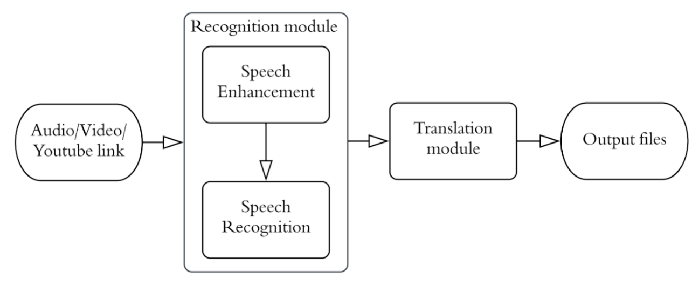
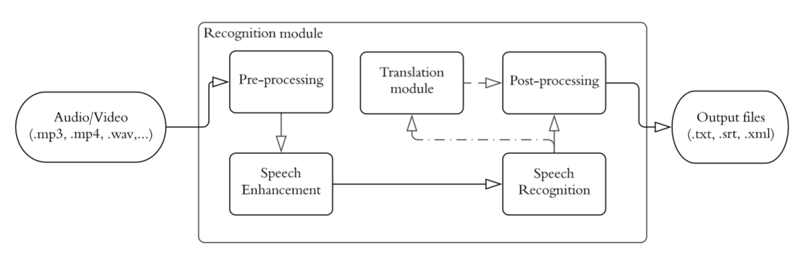
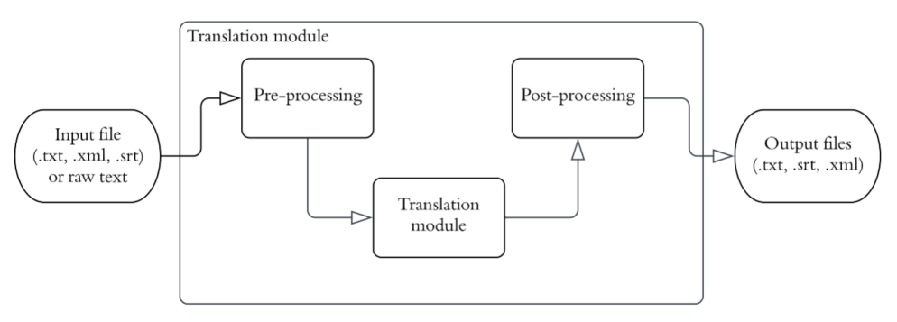
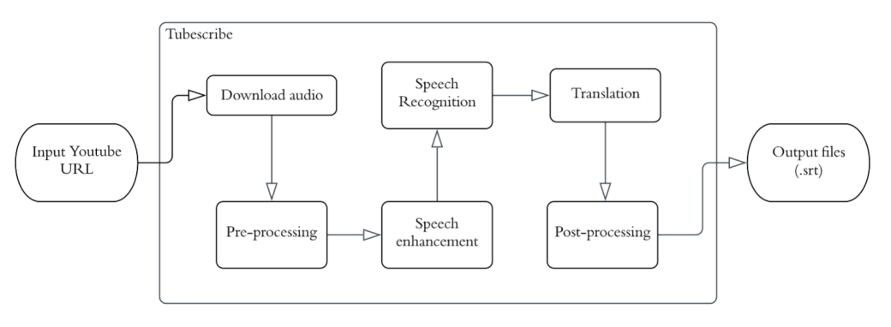
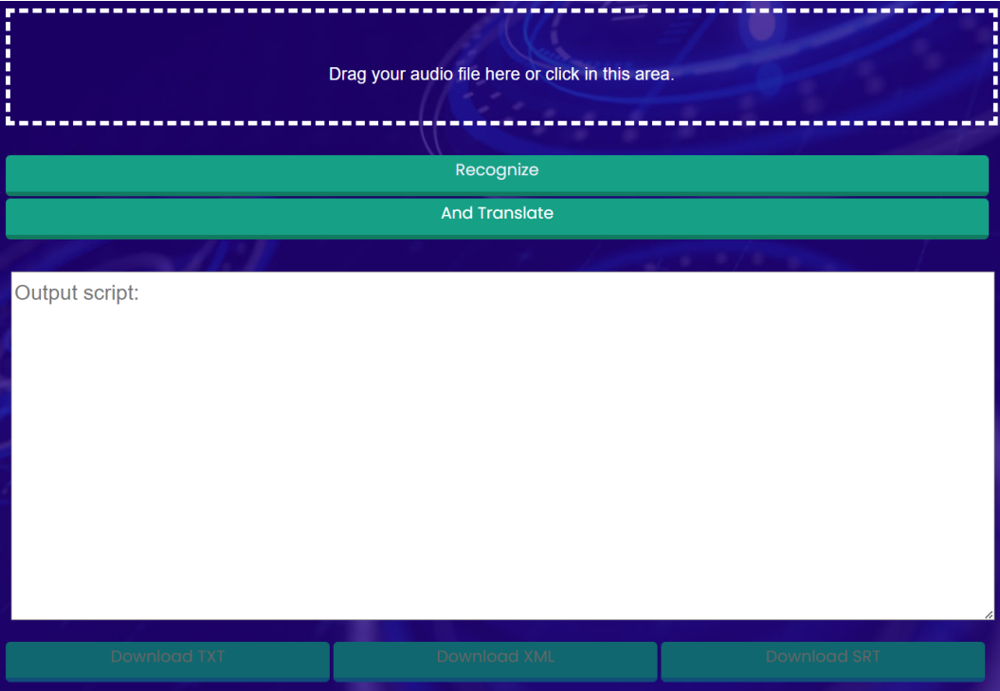
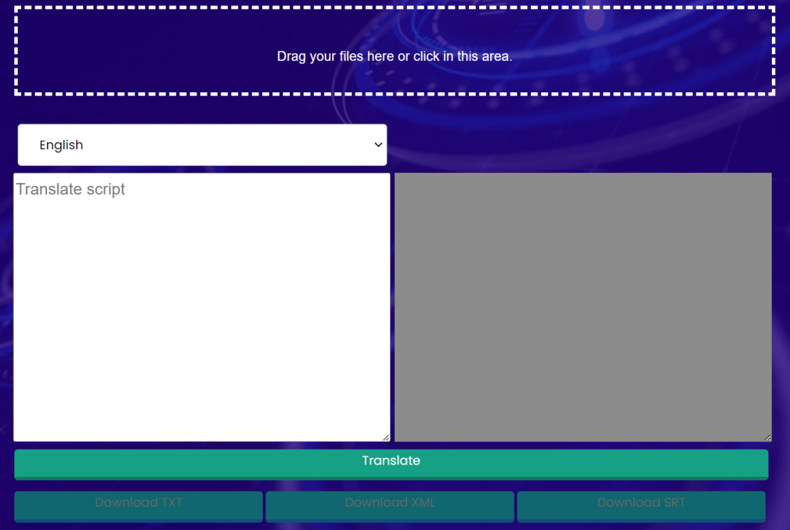

# **Capstone-Project-SP23**

This repo contains all source code of our capstone project about ***English to Vietnamese subtitle generation system***

## **Contributors**

- Le Hoang Phuc
- Ngo Anh Kiet
- Kieu Minh Duy
  
## **Objectives and Contributions**

The main goal of this research is to create the ***N2Vi - English to Vietnamese subtitle generation system*** that provides ease of access for Vietnamese users. This thesis proposes an effective pipeline for creating Vietnamese subtitles based on speech processing, and the latest models to achieve this goal. Our approach builds upon previous developments and leverages deep neural networks with transfer learning and attention mechanisms to improve the quality of speech signals. Besides, we also collected a dataset and used it to evaluate some recent state-of-the-art models and then come up with the most suitable ones for our system. Last but not least, we also dig down into those models to carry out processing methods that can improve the final outputs.

## **Models**

In this project, we inherent 3 latest pretrained models in speech enhancement, speech recognition,  and machine translation. Which are [denoiser's DEMUCS](https://arxiv.org/pdf/2006.12847.pdf), [Whisper-medium](https://cdn.openai.com/papers/whisper.pdf), and [EnViT5-base](https://arxiv.org/pdf/2210.05610.pdf).

## **Overview full pipeline flow**

For full pipeline, our system runs through the following phases:



## **Stand-alone feature flows**

### ***Recognition feature***

At first, this
feature takes the input file from users, which is formatted in “.mp3”, “.wav”, “.mp4”, and “.m4a”. If the input is a video file, audio will be extracted in the preprocessing step. After that, 16kHz loaded audio will be enhanced and passed into the recognition model. We give the user two options in this feature, i.e., recognizing the input file in English or Vietnamese. If the user wants to get Vietnamese content out of the input file, the translation model will get in charge. After post-processing steps and file exportation, the user will be able to preview the context of the input file and available “.txt”, “.str”, and “.xml” files to download. Based on the user's selection, these output files contain either English or Vietnamese.



### ***Translation feature***

The translation feature, alone, is quite simple, shown in Figure 3.2 above. The user can upload a “.txt”, “.str”, or “.xml” file to our system, then they must choose what language is used in this file. In the next step, our system will pre-process and put the extracted into the translation model to return the translated files. One notation is that when the user uploads the “.txt” file, the translation feature will only return the “.txt” file. For other file formats, both “.txt”, “.str”, and “.xml” are available.



### ***Tubescribe feature***

Last but not least, an application designed to help users in Vietnam access content from a seemingly endless source of videos from Youtube, Tubescribe. “Tubescribe” is a short-term Youtube scribe. End-user only needs to paste the Youtube video URL they want to transcribe to the input box. After that, the video's audio will be downloaded by the pytube package and loaded. After ensuring that the audio is loaded, ***N2Vi*** will transmit to the speech enhancement model. Once the enhancement is complete, its output will be recognized and passed into the translation model. The ".srt” file can be downloaded when the process is done. If users then want to watch Youtube videos with Vietnamese subtitles, we recommend they install a third-party extension to their browser named **“Subtitles for Youtube”** and then upload the system's “.srt” output file.



## **Web app interface**

### ***Recognition feature***



### ***Translation feature***



### ***Tubescribe feature***


## **Requirements**

```pip install -r requirements.txt```

## **Run app**

For ***Windows***, run following line in commandprompt:

```python app.py```

For ***Linux/Ubuntu***, run the following line in terminal:

```python3 app.py```


## **References**
- Facebook AI Research: [denoiser's DEMUCS](https://arxiv.org/pdf/2006.12847.pdf)
- OpenAI multi-tasking: [Whisper-medium](https://cdn.openai.com/papers/whisper.pdf)
- VietAI T5 fine-tuned on MTet:[EnViT5-base](https://arxiv.org/pdf/2210.05610.pdf)